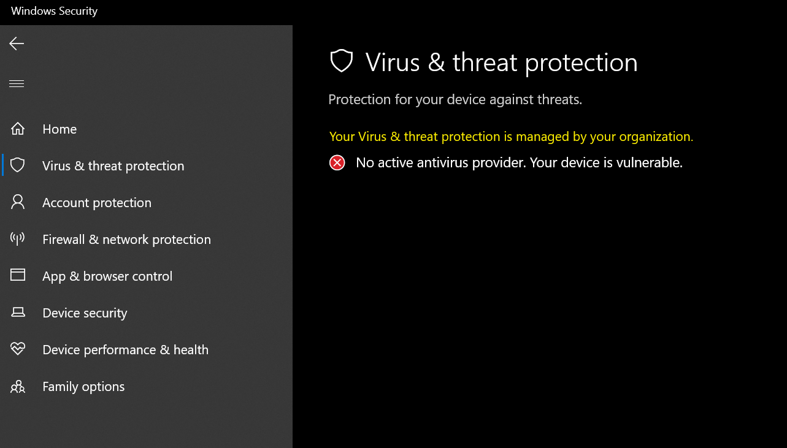

# defender-disabler
a simple C++ tool using the windows registry to disable windows defender

Have you ever had Windows Defender call a perfectly safe program a random malware name with some random symbol sprinkles on it? Have you ever had Windows Defender try to kill Visual Studio (a windows program) because it thought that the debugger was a piece of malware?

Probably not, but if you fall into that category like me, this is a great tool to fix those issues.

